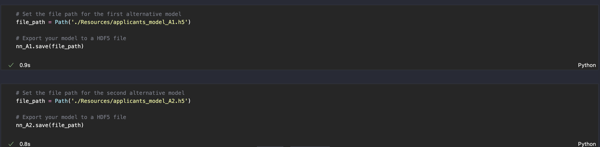

# *Venture funding with deep learning*
---

**Welcome to my repository for the venture-funding analysis. Please explore the codebase!** <br />

---
## Analytical Summary

This project presents a deep-learning model that predicts whether a startup will become successful. 

---

## Technologies

This project leverages python 3.7 with the following packages:

* [pandas](https://pandas.pydata.org) - Library for reading/writing csv files and fast manipulation with DataFrames.

* [pathlib](https://docs.python.org/3/library/pathlib.html) - Library for filesystem paths.

* [tensorflow](https://www.tensorflow.org/) - Library for building advanced models (i.e. deep-learning models).

* [sklearn](https://scikit-learn.org/stable/) - Library for predictive-data analysis.
 
 * [KerasTuner](https://keras.io/keras_tuner/) - Library for hyperparameter tuning.
---

## Installation Guide

Before running the application first install the following dependencies.

```python

  pip install pandas
  pip install pathlib
  pip install tensorflow
  pip install -U scikit-learn
  pip install -q -U keras-tuner

```
---

## Usage

To use this project simply clone the repository and run the code **venture_funding_with_deep_learning.ipynb** in JupyterLab or in VS Code.

---

## Methodologys
This project helps a venture-capital firm to direct funding to potentially successful businesses. A deep-learning model trains on over 30.000 organizations and predicts if an applicant business is going to become successful. 
The dataset takes on the following form:


The first deep-learning model incorporates one hidden layer, 58 nodes for the input layer, 29 nodes for the hidden layer and one output node.


The model runs 50 epochs:


The model outcome is scrutinized with Keras-tuner that optimizes the values for the first hidden layer and also the value for the learning rate.


Two additional models incorporate the findings from the Keras-tuner.
All the models are saved as HDF5 files.


---

## License

MIT

---


 
